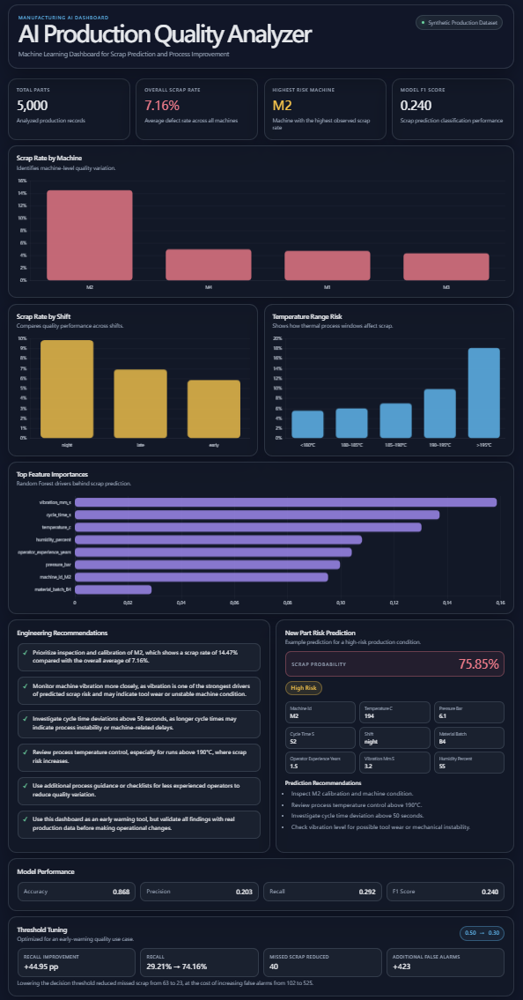

# AI Production Quality Analyzer

Machine Learning Dashboard for Scrap Prediction and Process Improvement

## Overview

This project demonstrates an end-to-end AI workflow for manufacturing quality analytics. It uses a synthetic production dataset to predict scrap risk, identify key process drivers, visualize quality patterns, and generate engineering recommendations.

The goal is to show how machine learning can support production quality monitoring and process improvement in a manufacturing environment.

## Problem Statement

In manufacturing, scrap parts increase production cost, reduce process stability, and create additional inspection or rework effort. Quality engineers need to identify which machines, process parameters, or operating conditions contribute most to scrap risk.

This project addresses the following question:

> Can machine learning help identify high-risk production conditions and support structured process improvement?

## Project Output

The project produces five main outputs:

- A synthetic manufacturing quality dataset
- A trained Random Forest scrap prediction model
- A static HTML/CSS/JavaScript analytics dashboard
- An automated Markdown quality analysis report
- A sample prediction script for new production records

## Dashboard Preview

The dashboard includes KPI cards, machine-level scrap analysis, shift comparison, temperature risk analysis, feature importance visualization, and engineering recommendations.



## Live Dashboard

The dashboard is deployed with GitHub Pages:

https://godric1201.github.io/ai-production-quality-analyzer/dashboard/

If the preview image is not available, run the dashboard locally using the instructions below.

## Key Features

- Synthetic production data generation with realistic manufacturing risk patterns
- Scrap prediction using a Random Forest classifier
- New-part scrap risk prediction using the trained model
- One-hot encoding for categorical production variables
- Feature importance analysis for process driver identification
- KPI dashboard for production quality monitoring
- Engineering recommendations based on model and process analysis
- Automated quality report generation in Markdown format

## Dataset

The dataset is synthetic but designed to simulate realistic production quality data.

Each row represents one produced part.

### Columns

| Column | Description |
|---|---|
| `part_id` | Unique part identifier |
| `machine_id` | Machine used for production |
| `temperature_c` | Process temperature in degrees Celsius |
| `pressure_bar` | Process pressure in bar |
| `cycle_time_s` | Production cycle time in seconds |
| `shift` | Production shift: early, late, or night |
| `material_batch` | Material batch identifier |
| `operator_experience_years` | Operator experience in years |
| `vibration_mm_s` | Machine vibration level |
| `humidity_percent` | Ambient humidity |
| `scrap` | Target variable: 1 = scrap, 0 = good part |

### Synthetic Risk Logic

The data generation process includes engineered quality patterns:

- Machine M2 has a higher scrap risk than other machines.
- Temperature above 190°C increases scrap risk.
- Cycle time above 50 seconds increases scrap risk.
- Night shift has slightly higher scrap risk.
- Higher vibration increases scrap risk.
- More operator experience slightly reduces scrap risk.

## Machine Learning Approach

The machine learning pipeline uses a Random Forest classifier to predict whether a part is likely to become scrap.

Pipeline steps:

1. Load production quality data
2. Split features and target variable
3. One-hot encode categorical features
4. Train a Random Forest classifier
5. Evaluate model performance
6. Export metrics, feature importances, and trained model
7. Export dashboard-ready JSON data
8. Predict scrap risk for a new production record

Random Forest was selected because it performs well on tabular data, handles nonlinear feature interactions, and provides interpretable feature importance values.

## Model Results

Current model performance:

| Metric | Value |
|---|---:|
| Accuracy | 0.868 |
| Precision | 0.203 |
| Recall | 0.292 |
| F1 Score | 0.240 |

The model achieves high overall accuracy, but the F1 score is lower because scrap cases are relatively rare compared with good parts. This is a typical issue in quality prediction problems with imbalanced production data.

For a real production use case, recall and threshold tuning would be important because missing defective parts may be more costly than generating false alarms.

## Key Findings

The analysis identified the following quality patterns:

- Overall scrap rate: 7.16%
- Highest-risk machine: M2
- M2 scrap rate: 14.47%
- Sample high-risk part prediction: 75.85% scrap probability
- Top model drivers include:
  - machine vibration
  - cycle time
  - process temperature
  - operator experience
  - machine-specific effects

## Engineering Recommendations

Based on the analysis, the following actions are recommended:

1. Inspect and calibrate machine M2.
2. Monitor machine vibration as an indicator of unstable machine condition or tool wear.
3. Investigate cycle time deviations above 50 seconds.
4. Review process temperature control, especially above 190°C.
5. Use additional checklists or process guidance for high-risk production conditions.

## Tech Stack

| Area | Technology |
|---|---|
| Data processing | Python, pandas, NumPy |
| Machine learning | scikit-learn |
| Model persistence | joblib |
| Dashboard | HTML, CSS, JavaScript |
| Charts | Chart.js |
| Report generation | Markdown |
| Version control | Git |

## Repository Structure

```text
ai-production-quality-analyzer/
│
├── data/
│   └── production_quality_data.csv
│
├── src/
│   ├── generate_data.py
│   ├── train_model.py
│   ├── analyze_quality.py
│   ├── export_dashboard_data.py
│   └── predict_new_part.py
│
├── dashboard/
│   ├── index.html
│   ├── style.css
│   ├── app.js
│   └── dashboard_data.json
│
├── docs/
│   └── dashboard-preview.png
│
├── outputs/
│   ├── feature_importance.csv
│   ├── model_metrics.json
│   ├── quality_report.md
│   └── scrap_prediction_model.joblib
│
├── requirements.txt
└── README.md
```

## How to Run Locally

### 1. Clone the repository

```bash
git clone <repository-url>
cd ai-production-quality-analyzer
```

### 2. Create a virtual environment

Windows PowerShell:

```powershell
python -m venv .venv
.venv\Scripts\Activate.ps1
```

macOS / Linux:

```bash
python3 -m venv .venv
source .venv/bin/activate
```

### 3. Install dependencies

```bash
pip install -r requirements.txt
```

### 4. Generate synthetic data

```bash
python src/generate_data.py
```

### 5. Train the model

```bash
python src/train_model.py
```

### 6. Export dashboard data

```bash
python src/export_dashboard_data.py
```

### 7. Generate the quality report

```bash
python src/analyze_quality.py
```

### 8. Predict scrap risk for a new part

The project also includes a sample prediction script for a new production record:

```bash
python src/predict_new_part.py
```

Example output:

```text
New Part Scrap Risk Prediction
====================================

Prediction:
  Scrap probability: 75.85%
  Risk level: High

Recommendations:
  - Inspect M2 calibration and machine condition.
  - Review process temperature control above 190°C.
  - Investigate cycle time deviation above 50 seconds.
  - Check vibration level for possible tool wear or mechanical instability.
```

### 9. Start local dashboard server

```bash
python -m http.server 8000
```

Open the dashboard in your browser:

```text
http://localhost:8000/dashboard/
```

## Outputs

### Dashboard

The static dashboard visualizes:

- Total parts analyzed
- Overall scrap rate
- Highest-risk machine
- Model F1 score
- Scrap rate by machine
- Scrap rate by shift
- Scrap rate by temperature range
- Feature importances
- Engineering recommendations

### Quality Report

The automated report is generated at:

```text
outputs/quality_report.md
```

It includes:

- Executive summary
- Dataset overview
- Model approach
- Model performance
- Key process drivers
- Machine-level quality analysis
- Engineering recommendations
- Limitations
- Future improvements

### New Part Prediction

The prediction script is located at:

```text
src/predict_new_part.py
```

It loads the trained Random Forest model and predicts the scrap probability for a sample production record. The script also assigns a risk level and provides rule-based engineering recommendations.

## Limitations

This project uses synthetic data. Although the dataset was designed to simulate realistic manufacturing quality patterns, it does not represent a real production line.

Important limitations:

- The model should not be used for real operational decisions without validation on real production data.
- Feature importance values indicate model relevance, not physical causality.
- The current workflow uses batch data rather than real-time sensor data.
- The classification threshold has not yet been optimized for production-specific cost trade-offs.

## Future Improvements

Potential next steps:

- Add probability-based risk levels: low, medium, high
- Tune classification threshold to increase recall for scrap detection
- Add SHAP-based model explainability
- Allow command-line input for custom production records
- Add a form-based prediction interface to the static dashboard
- Deploy the dashboard through GitHub Pages
- Validate the workflow with open or real manufacturing datasets
- Extend the project toward predictive maintenance using time-series sensor data

## Project Relevance

This project connects several areas relevant to manufacturing digitalization:

- Mechanical engineering
- Production quality
- Process optimization
- Machine learning
- Industrial AI
- Industry 4.0
- Data-driven decision support