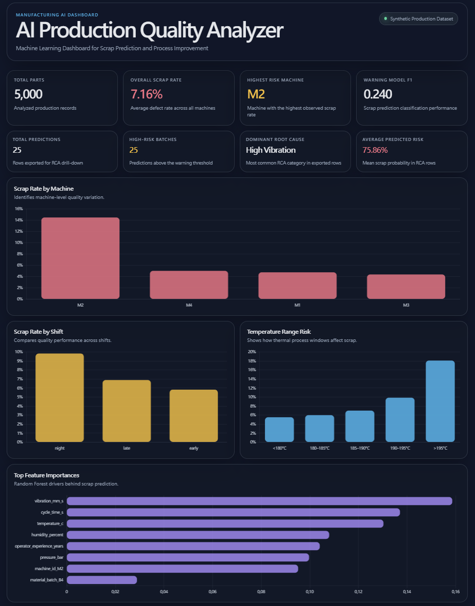
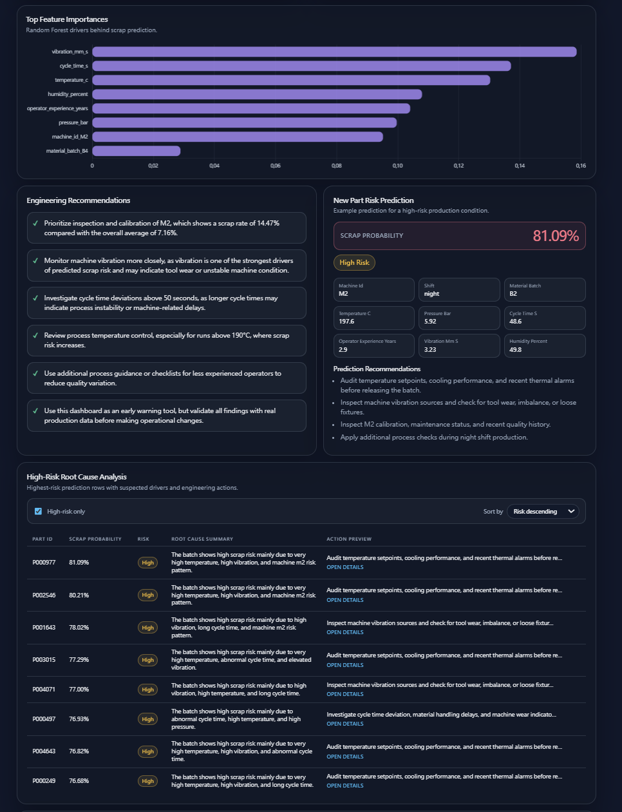
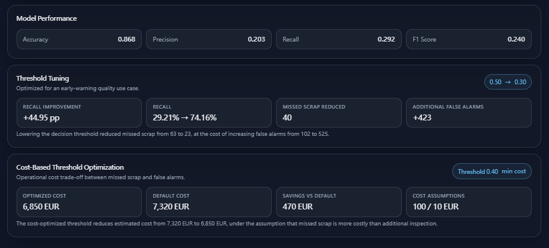

# AI Production Quality Analyzer

AI-assisted manufacturing quality analytics dashboard for scrap prediction, root cause investigation, and engineering action recommendations.

This is a portfolio project for AI, engineering, manufacturing digitalization, process engineering, and technical operations roles. It uses synthetic manufacturing data to demonstrate an end-to-end quality analytics workflow. It is not a production factory system.

## Problem

Manufacturing teams need to identify high-risk production batches, understand process drivers, and prioritize engineering actions before quality losses become expensive. Traditional dashboards often show scrap rates after the fact, but teams also need early-warning indicators, root cause context, and action-oriented recommendations.

This project shows how a lightweight AI-assisted workflow can support that decision process.

## What This Project Does

- Predicts scrap risk for production records.
- Analyzes process drivers such as vibration, cycle time, temperature, machine, shift, material batch, and operator experience.
- Performs rule-based root cause analysis for elevated-risk predictions.
- Generates engineering recommendations for high-risk batches.
- Exports dashboard-ready JSON data.
- Creates a Markdown quality report.
- Supports RCA drill-down investigation in the dashboard.
- Includes classification threshold tuning and cost-based decision reasoning.

## Dashboard Screenshots

### Dashboard Overview



### RCA Investigation Table



### Model Threshold and Cost View



## Core Workflow

```text
Synthetic Production Data
  -> Feature Engineering
  -> Scrap Risk Model
  -> Root Cause Analysis
  -> Engineering Recommendations
  -> Dashboard + Markdown Report
```

## Key Features

- Synthetic manufacturing dataset with realistic quality-risk patterns.
- Random Forest scrap-risk classifier for tabular production data.
- Model comparison across Logistic Regression, Random Forest, and Gradient Boosting.
- Feature importance analysis for process-driver interpretation.
- Threshold tuning for early-warning quality monitoring.
- Cost-based threshold analysis using missed-scrap and false-alarm assumptions.
- Rule-based RCA module for manufacturing process conditions.
- Dashboard RCA table with filtering, sorting, and drill-down side panel.
- Markdown quality report with model, cost, process, RCA, and recommendation sections.
- Static frontend built with HTML, CSS, JavaScript, and Chart.js.

## Technical Stack

| Area | Technology |
| --- | --- |
| Data processing | Python, pandas, NumPy |
| Machine learning | scikit-learn |
| Model persistence | joblib |
| Dashboard | HTML, CSS, JavaScript |
| Charts | Chart.js |
| Report generation | Markdown |
| Version control | Git |

## Repository Structure

```text
ai-production-quality-analyzer/
|-- data/
|   `-- production_quality_data.csv
|-- dashboard/
|   |-- app.js
|   |-- dashboard_data.json
|   |-- index.html
|   `-- style.css
|-- docs/
|   |-- dashboard-overview.png
|   |-- dashboard-threshold.png
|   `-- screenshots/
|       `-- README.md
|-- outputs/
|   |-- best_model_summary.json
|   |-- cost_optimized_threshold.json
|   |-- feature_importance.csv
|   |-- model_comparison.csv
|   |-- model_metrics.json
|   |-- prediction_results.csv
|   |-- quality_report.md
|   |-- scrap_prediction_model.joblib
|   |-- selected_threshold.json
|   |-- threshold_cost_analysis.csv
|   `-- threshold_metrics.csv
|-- src/
|   |-- analyze_quality.py
|   |-- compare_models.py
|   |-- export_dashboard_data.py
|   |-- generate_data.py
|   |-- optimize_threshold_cost.py
|   |-- predict_new_part.py
|   |-- root_cause_analysis.py
|   |-- run_pipeline.py
|   |-- train_model.py
|   `-- tune_threshold.py
|-- requirements.txt
`-- README.md
```

## How to Run

### 1. Create a Virtual Environment

Windows PowerShell:

```powershell
python -m venv .venv
.\.venv\Scripts\Activate.ps1
```

macOS / Linux:

```bash
python3 -m venv .venv
source .venv/bin/activate
```

### 2. Install Dependencies

```bash
pip install -r requirements.txt
```

### 3. Generate the Synthetic Dataset

The repository includes a generated dataset, but it can be recreated with:

```bash
python src/generate_data.py
```

### 4. Run the Full Pipeline

```bash
python src/run_pipeline.py
```

This trains the model, compares classifiers, tunes thresholds, optimizes threshold cost, exports dashboard data, and generates the Markdown report.

### 5. Open the Dashboard Locally

From the repository root:

```bash
python -m http.server 8000
```

Then open:

```text
http://localhost:8000/dashboard/
```

## Useful Individual Commands

```bash
python src/train_model.py
python src/compare_models.py
python src/tune_threshold.py
python src/optimize_threshold_cost.py
python src/export_dashboard_data.py
python src/analyze_quality.py
python src/predict_new_part.py
```

## Outputs

Key generated outputs:

- `outputs/quality_report.md` - automated quality analysis report with RCA and engineering actions.
- `outputs/prediction_results.csv` - row-level predictions with RCA summaries and recommendation text.
- `dashboard/dashboard_data.json` - dashboard-ready data payload used by the static frontend.

Additional model and analysis outputs:

- `outputs/model_metrics.json`
- `outputs/model_comparison.csv`
- `outputs/best_model_summary.json`
- `outputs/feature_importance.csv`
- `outputs/threshold_metrics.csv`
- `outputs/selected_threshold.json`
- `outputs/threshold_cost_analysis.csv`
- `outputs/cost_optimized_threshold.json`
- `outputs/scrap_prediction_model.joblib`

## Model and Analytics Scope

The model is intentionally used as an early-warning and decision-support workflow. It is not a final factory control system and should not be interpreted as an autonomous quality decision engine.

The purpose is to show how manufacturing data can be transformed into:

- Scrap-risk signals.
- Process-driver interpretation.
- Root cause investigation context.
- Cost-sensitive threshold reasoning.
- Engineering action recommendations.

In a real manufacturing environment, this workflow would require validation with production data, process-owner review, integration with quality systems, and monitoring of false alarms and missed defects.

## Limitations

- The dataset is synthetic and does not represent a specific factory, line, product, or supplier.
- There is no live machine, PLC, sensor-stream, MES, ERP, or quality-management-system connection.
- The RCA logic is deterministic and rule-based; it is designed for readability, not physical proof of causality.
- Feature importance and RCA outputs are decision-support signals, not confirmed root causes.
- Cost assumptions are illustrative and should be replaced with site-specific inspection, scrap, rework, and warranty costs.
- Results are for demonstration and portfolio purposes.

## Why This Project Matters

Manufacturing teams increasingly need practical AI workflows that connect machine learning outputs with engineering decisions. This project demonstrates that bridge:

- Manufacturing analytics: turning production records into quality insight.
- Process improvement: identifying recurring risk drivers such as vibration, cycle time, temperature, machine, material, and shift effects.
- Cost-sensitive quality control: comparing threshold choices using operational cost assumptions.
- AI-enabled operations: moving beyond predictions into root cause investigation and recommended actions.

The result is a compact portfolio project that connects mechanical engineering, production quality, data science, and industrial digitalization.
